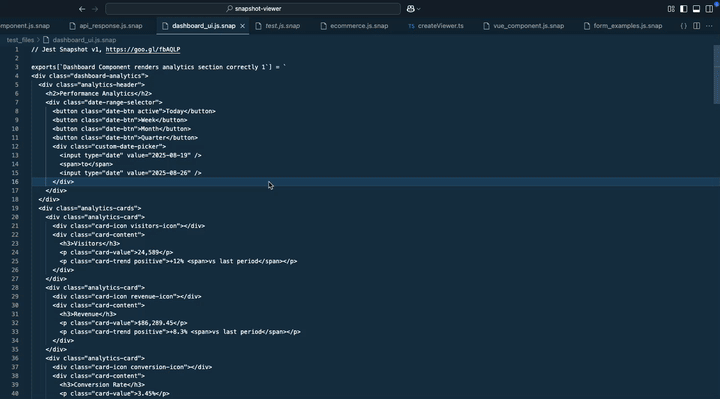

# snapshot-viewer

`snapshot-viewer` is a Visual Studio Code extension for previewing `.snap` snapshot files. It provides commands to view the contents of snapshot files in a readable HTML format directly from VS Code. When activated, the extension parses the selected `.snap` file, converts its contents to HTML, and opens the result for easy inspection. This is useful for developers working with Jest or other snapshot-based testing frameworks who want a quick way to visualize snapshot data.

## Run a command

Press Shift + Command + P to open up the Command Pane with a .snap file open

Search for either:

`View snapshot: Browser`
Browser will open up the preview in your default browser

`View snapshot: VSCode`
VSCode will open up a new pane next to the snapshot allowing you to preview it in VS code, it will also watch for changes and update accordingly.

## Demo

**Enjoy!**
